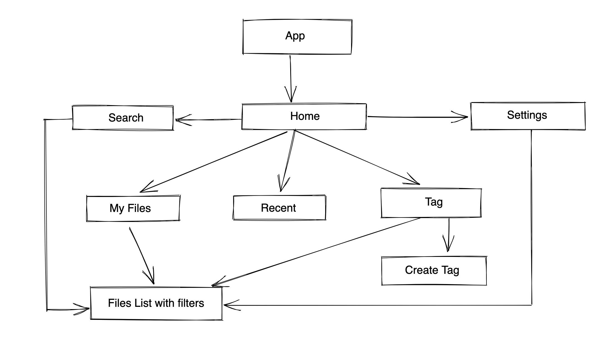

# 20 April 2023

- Today I worked on creating the over all navigation routes.
  With routes in place I just have to fill into them.

- I initially thought of adding navigation using accompanist library but for some reason I couldn't
  see the screen at all.

- I have also added splash screen with splash screen api but yet to add custom icon on the splash
  screen.

- Application has the routes like below. This is how user navigates
  

- There are some routes missing which I will add later

- The application might look simple but as I plan to implement it sure has lot to learn 😌.

## References

1. [Android Developer](https://developer.android.com/jetpack/compose/navigation)
