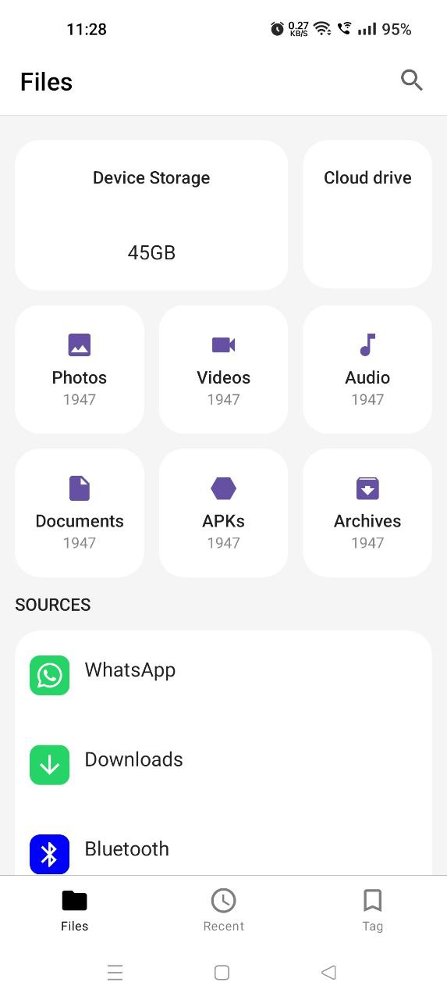

# 21 April 2023

- Today I have added files group screen UI

- I made use of lazy grid and learnt more about it

- I have yet to add a proper color pallete so the colors are bit confusing

- To add groups I have used sealed classes as they are fixed number of items. Actually I had though
  of data class but went with sealed class instead

- I still need to figure out how to add the files count to each group card?

App Looks like this as of today

## References

1. [Jetpack Grids](https://www.valueof.io/blog/lazy-grids-gridcells-fixed-adaptive-custom-compose)
